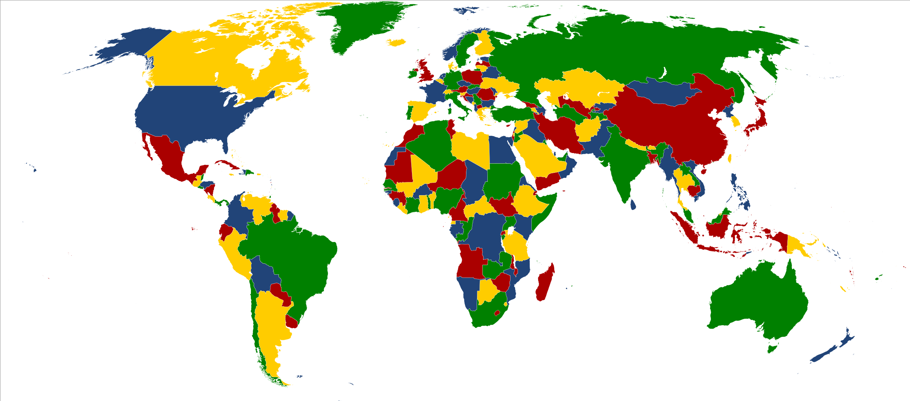

# colours-clustering
clustering the colors of an image with KMeans algorithm.

I choose the following image because it painted with separate colors and its clusters is more readable.

## The project summary
In this project, I want to cluster the colors image with image `hue` as feature and `K_means` as training algorithm.
First the all, I read the image and after that, since i read the image with `opencv` the channel is BGR, so I convert BGR to RGB because I showed the image with `matplotlib`.
I choose `matplotlib` for showing image because matplotlib can show inside the jupyter notebook, by contrast `Opencv` show the image in a separate window.

after I again convert the image channels to `HSV` For the sake of gain the hue feature. next extracting the `hue` feature from HSV image. after it, `normalization` and `feature scaling` the data(hue values).
Now, it's time for training and fitting the data, I selected 4 `n_clusters` the hyperparameter of the `K_means`.
since the `K_means` labels predictions are just integers numbers and in oeder to for showing it the picture mood, I first assigned to each labels a color code and after I display the image.

**Find the best n_clusters**
For doing that I use the `elbow method` and `histogram method`, after doing that I realize the best value for n_clusters is 4 which I choose from the past.
